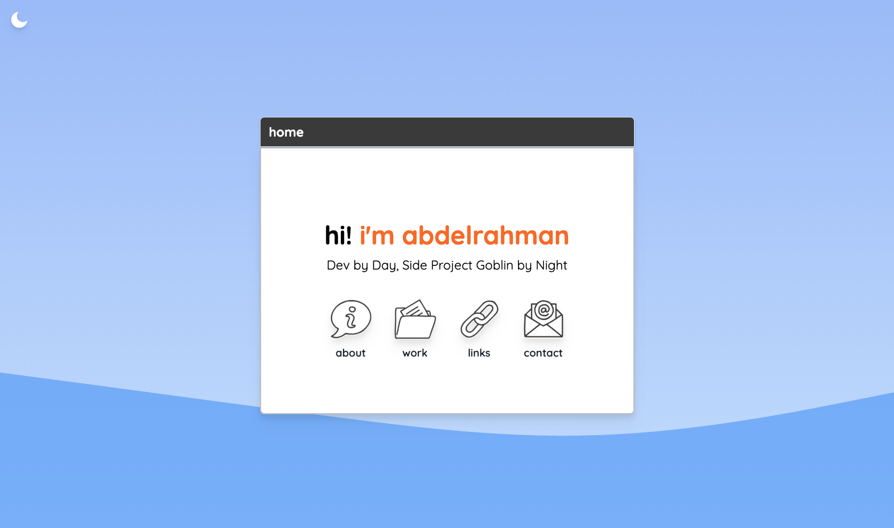
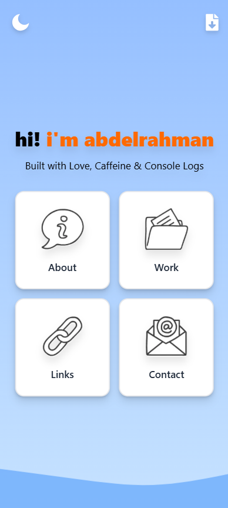
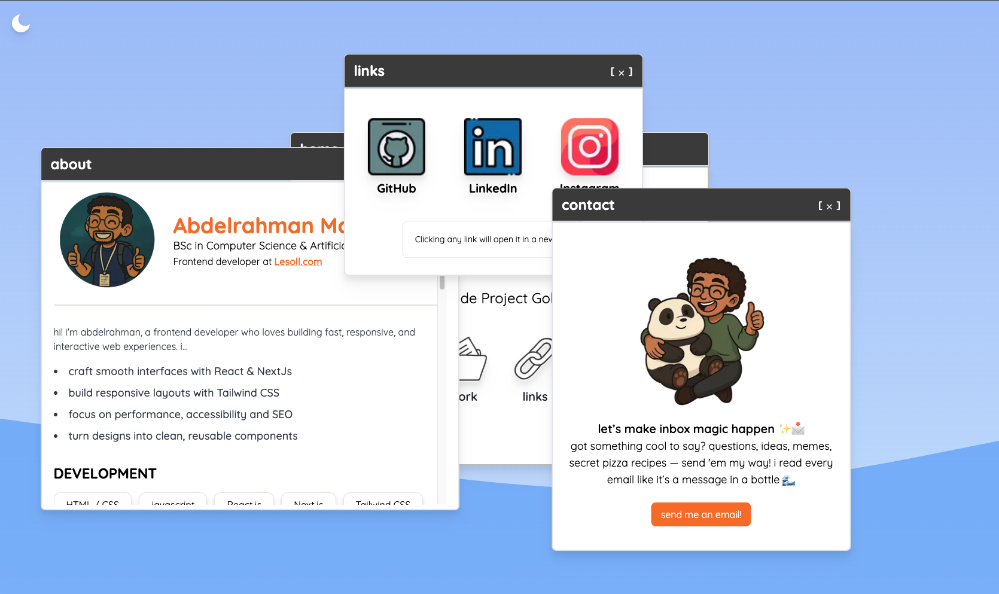

# 💻 Portfolio Website

Welcome to my personal portfolio!  
This project is a playful, interactive desktop-like experience built with **Next.js** and **Framer Motion**. I wanted to move away from the usual "scroll-and-read" sites and make something that feels alive and fun to explore — just like cracking open an old OS.

---

## ✨ Features

- 🖥️ **Desktop UI Experience**

  - Every section (About, Work, Contact, Links) behaves like a draggable window.
  - Windows can be opened, closed, stacked, and moved freely — just like a desktop OS.
  - Multiple windows can be opened at once for full chaos mode.

- 📱 **Mobile-first Custom Behavior**

  - Mobile view uses a different layout:  
    Clicking a section opens a fullscreen drawer-style modal from the bottom.
  - Only one window can be open at a time on mobile to keep the UI clean and practical.

- ⚡ **Animations with Framer Motion**

  - Smooth transitions between states.
  - Dragging, opening, and closing windows feels fluid and snappy.

- 🌙 **Dark Mode Toggle**
  - Easy on the eyes with a theme switcher in the corner.

---

## 🛠️ Built With

- [Next.js](https://nextjs.org/)
- [Framer Motion](https://www.framer.com/motion/)
- [Tailwind CSS](https://tailwindcss.com/)

---

## 📷 Screenshots

| Desktop                                           | Mobile                                          |
| ------------------------------------------------- | ----------------------------------------------- |
|         |         |
|  |  |

---

## 🚀 Getting Started

```bash
# Clone the repo
git clone https://github.com/AbdelrahmanMostafa0/portfolio.git

# Go into the project directory
cd portfolio

# Install dependencies
npm install

# Start the development server
npm run dev

```
